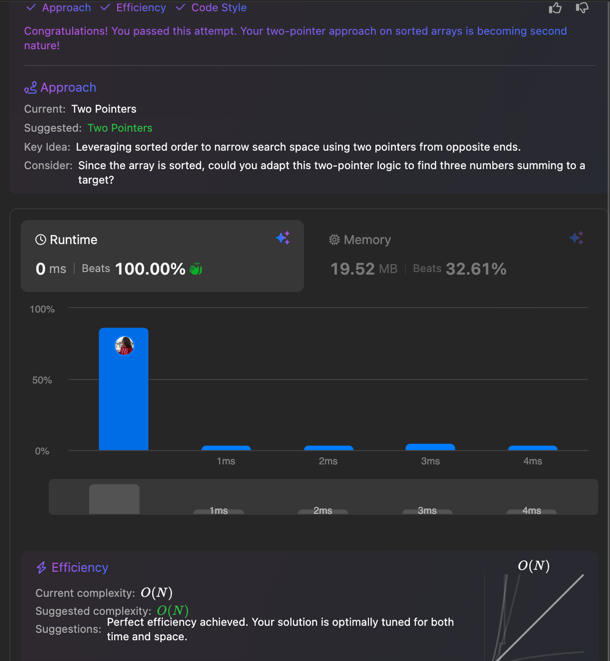

# Two Sum II - Input Array Is Sorted

[Leetcode](https://leetcode.com/problems/two-sum-ii-input-array-is-sorted/description/)


Given a 1-indexed array of integers numbers that is already sorted in non-decreasing order, find two numbers such that they add up to a specific target number. Let these two numbers be numbers[index1] and numbers[index2] where 1 <= index1 < index2 <= numbers.length.

Return the indices of the two numbers index1 and index2, each incremented by one, as an integer array [index1, index2] of length 2.

The tests are generated such that there is exactly one solution. You may not use the same element twice.

Your solution must use only constant extra space.

## Two Pointer Approach

- Leveraging sorted order of the array

```cpp
class Solution {
public:
    vector<int> twoSum(vector<int>& numbers, int target) {
        int n = numbers.size();
        int left = 0, right = n - 1;
        while(left <= right){
            int discoveredSum = numbers[left] + numbers[right];

            if(discoveredSum > target){
                right--;
            }else if(discoveredSum < target){
                left++;
            }else{
                return {left+1, right+1};
            }
        }
        return {-1,-1};
    }
};
```

> Time Complexity: O(n)
> 
> Space Complexity: O(1)

