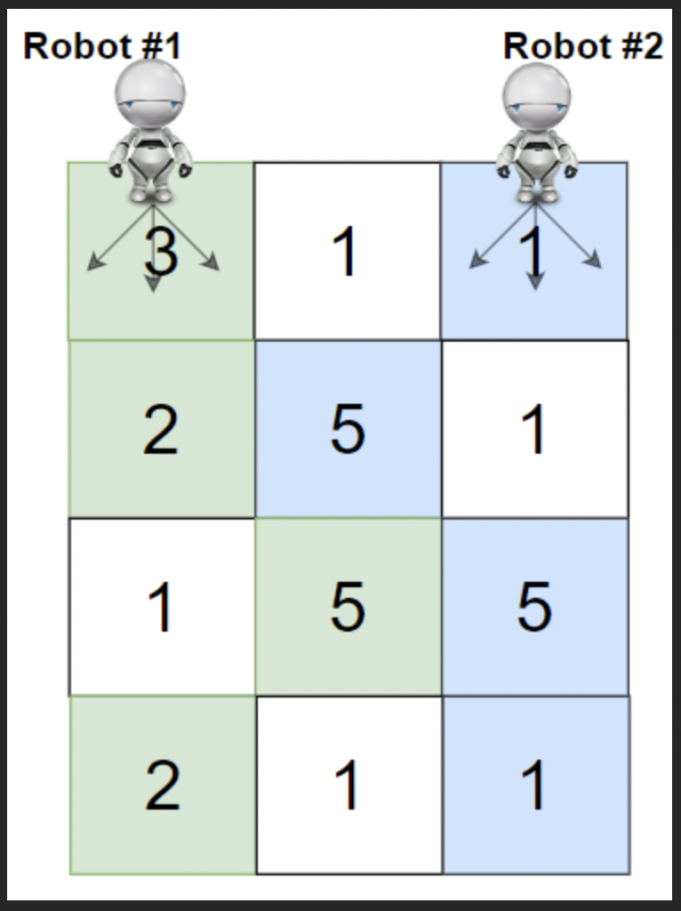

 # Cherry Pickup - II

Practice [Link](https://leetcode.com/problems/cherry-pickup-ii/)


You are given a rows x cols matrix grid representing a field of cherries where `grid[i][j]` represents the number of cherries that you can collect from the (i, j) cell.

You have two robots that can collect cherries for you:

Robot #1 is located at the top-left corner `(0, 0)`, and
Robot #2 is located at the top-right corner `(0, cols - 1)`.
Return the maximum number of cherries collection using both robots by following the rules below:

From a cell `(i, j)`, robots can move to cell `(i + 1, j - 1)`, `(i + 1, j)`, or `(i + 1, j + 1)`.
When any robot passes through a cell, It picks up all cherries, and the cell becomes an empty cell.
When both robots stay in the same cell, only one takes the cherries.
Both robots cannot move outside of the grid at any moment.
Both robots should reach the bottom row in grid.


## Sample



> Output: 24
>

## DP Approach

```cpp
class Solution {
public:

    bool isValidPos(int j1, int j2, int n )
    {
        if(j1<0 || j1>n-1 || j2<0 || j2>n-1)
            return false;
        return true;
    }

    int cherryPickupUtil(vector<vector<int>>& grid, int m, int n, int i, int j1, int j2, vector<vector<vector<int>>> &memo)
    {
        if(!isValidPos(j1,j2,n))
            return INT_MIN;

        if(memo[i][j1][j2]!=-1)
            return memo[i][j1][j2];

        if(i==m-1)
        {
            if(j1==j2)
                return memo[i][j1][j2] = grid[i][j1];
            else
                return memo[i][j1][j2] = grid[i][j1] + grid[i][j2];
        }
        int maxi = INT_MIN;
        for(int r1=-1;r1<=1;r1++)
        {
            for(int r2=-1;r2<=1;r2++)
            {
                int ans = 0;
                if(j1==j2)
                    ans = grid[i][j1] + cherryPickupUtil(grid, m,n, i+1, j1+r1, j2+r2, memo);
                else
                    ans = grid[i][j1] + grid[i][j2] + cherryPickupUtil(grid, m,n, i+1, j1+r1, j2+r2, memo);
                maxi = max(maxi, ans);
            }
        }
        return memo[i][j1][j2] = maxi;
    }

    int cherryPickup(vector<vector<int>>& grid) {
        int m = grid.size();
        int n  = grid[0].size();

        vector<vector<vector<int>>> memo(m, vector<vector<int>>(n, vector<int>(n,-1)));

        return cherryPickupUtil(grid, m, n, 0, 0, n-1, memo);
    }
};
```

> Time Complexity:`O(R*C*C)`, where R is the number of rows and C is the number of columns, due to the memoization and the nested loops in maxChocolatesUtil.
>
> Space Complexity:`O(R*C*C)` due to the memoization table and the recursive stack space can be ignored since it is less than R*C*C.