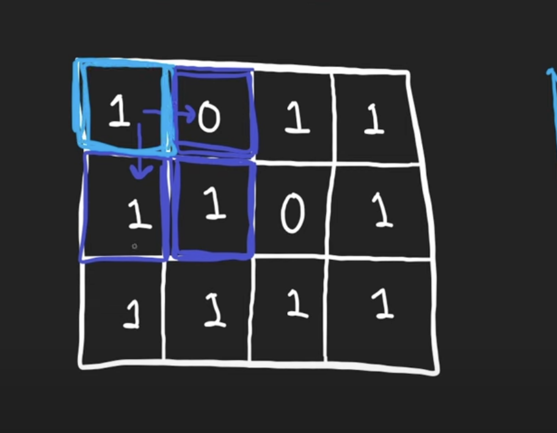

# Maximal Square

Practice [Link](https://leetcode.com/problems/maximal-square/description/)

Given an `m x n` binary matrix filled with `0's` and `1's`, find the largest square containing only `1's` and return its area.

## Brute Force

- At each cell(i), check the largest square that can be formed ending at cell(i).
- Inefficient - O((m*n)<sup>2</sup>)


## Better Approach

The problem can be broken down into subproblems.


- At each cell (i, j) in the matrix, we want to know:

  - What's the size of the largest square ending at this cell?

- This gives us a natural subproblem:

  - Let `dp[i][j]` = the side length of the largest square ending at (i, j).

### Building subproblem

- Let’s consider cell (i, j):

  - If `matrix[i][j] == '0'`: It cannot be part of any square ending here → dp[i][j] = 0.
  - If `matrix[i][j] == '1'`: Then it can extend a square — but only if the neighboring cells also support a square.
- To form a square ending at (i, j), the following 3 neighbors must also be part of a square:

  - Top → (i-1, j)
  - Left → (i, j-1)
  - Top-left → (i-1, j-1)

    > To form a square ending at (i, j), all three of these cells must
be the bottom-right corners of their own squares.


```cpp
class Solution {
public:
    int maximalSquare(vector<vector<char>>& matrix) {
        int m = matrix.size();
        int n = matrix[0].size();
        vector<vector<int>> dp(m, vector<int>(n, 0));

        int maxEdge=0;
        for(int i=0;i<m;i++){
            dp[i][0] = matrix[i][0]-'0';
            maxEdge = max(maxEdge, dp[i][0]);
        }
        
        for(int i=1;i<n;i++){
            dp[0][i] = matrix[0][i]-'0';
            maxEdge = max(maxEdge, dp[0][i]);
        }

        for(int i=1;i<m;i++)
        {
            for(int j=1;j<n;j++)
            {
                if(matrix[i][j]=='1')
                    dp[i][j] = 1 + min({dp[i-1][j], dp[i-1][j-1], dp[i][j-1]});
                maxEdge = max(maxEdge, dp[i][j]);
            }
        }

        return maxEdge*maxEdge;
    }
};
```

> Time Complexity: O(m*n)
>
> Space Complexity: O(m*n)

## Space Optimized Solution

```cpp
class Solution {
public:
    int maximalSquare(vector<vector<char>>& matrix) {
        int m = matrix.size();
        int n = matrix[0].size();
        vector<vector<int>> dp(m, vector<int>(n, 0));

        vector<int> prev(n, 0);
        vector<int> curr(n, 0);

        int maxEdge=0;
        for(int i=0;i<n;i++){
            prev[i] = matrix[0][i]-'0';
            maxEdge = max(maxEdge, prev[i]);
        }

        for(int i=1;i<m;i++)
        {
            curr[0] = matrix[i][0] - '0';
            maxEdge = max(maxEdge, curr[0]);

            for(int j=1;j<n;j++)
            {
                if(matrix[i][j]=='1')
                    curr[j] = 1 + min({prev[j], prev[j-1], curr[j-1]});
                else 
                    curr[j] = 0;
                
                maxEdge = max(maxEdge, curr[j]);
            }
            prev = curr;
        }

        return maxEdge*maxEdge;
    }
};
```

> Time Complexity: O(m*n)
>
> Space Complexity: O(n)