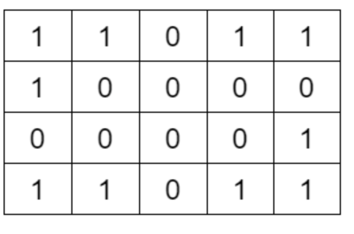
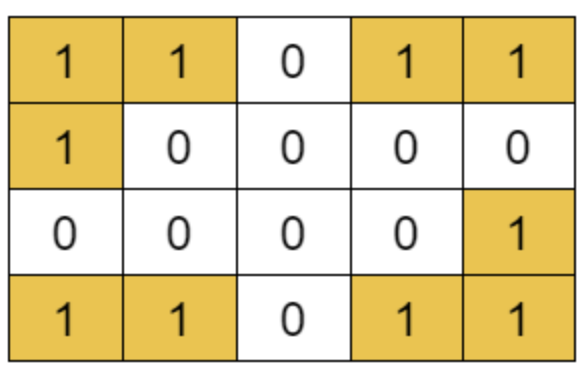

# Number of Islands


Given an ```m x n``` 2D binary grid grid which represents a map of '1's (land) and '0's (water), return the number of islands.

An island is surrounded by water and is formed by connecting adjacent lands horizontally or vertically. You may assume all four edges of the grid are all surrounded by water.

Practice [Link](https://leetcode.com/problems/number-of-islands/description/)

## Sample

> OUTPUT: 4
> 


## Implementation
```cpp
class Solution {
public:
    vector<int> dx={1,-1,0,0};
    vector<int> dy={0,0,1,-1};

    bool isValidCell(vector<vector<char>>& grid, int i, int j)
    {
        if(i<0 || i>= grid.size() || j<0 ||j>=grid[0].size() || grid[i][j]!='1')
            return false;
        return true;
    }
    void visitIslands(vector<vector<char>>& grid,int i, int j)
    {

        for(int dir=0;dir<4;dir++)
        {
            int ni = i + dx[dir];
            int nj = j + dy[dir];

            if(isValidCell(grid, ni,nj)){
                grid[ni][nj] = '*';
                visitIslands(grid, ni,nj);
            }
                
        }
    }

    int numIslands(vector<vector<char>>& grid) {
        int m = grid.size();
        int n = grid[0].size();

        int islands = 0;
        for(int i=0;i<m;i++)
        {
            for(int j=0;j<n;j++)
            {
                if(grid[i][j]=='1')
                {
                    visitIslands(grid, i, j);
                    islands++;

                }
            }
        }
        return islands;
    }
};
```

## Complexities
Time Complexity - ```O(V^2)```

Space Complexity - Auxilary Space