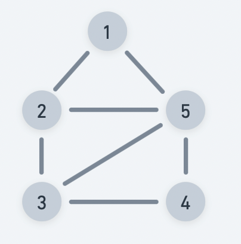

# BFS TRAVERSAL

Practice [Link](https://www.geeksforgeeks.org/problems/bfs-traversal-of-graph/1)

Give a graph G, Breadth First Search is a level order traversal of a graph.



> Output: [1,2,5,3,4]

## Intiution
- Checks all adjacent nodes of current node and then moves to next level.
- Maintain a visited visited arry to avoid visiting twice.
- Use queue to store explored nodes.
- Traversal terminates when all nodes are completely explored.


## Implementation
```
void bfsOfGraphUtil(vector<vector<int>> &adj, vector<int> &ans, vector<bool> &visited)
{
    queue<int> q;
    q.push(0);
    visited[0] = true;

    while(!q.empty())
    {
        int currNode = q.front();
        q.pop();
        
        ans.push_back(currNode);
        
        for(auto nextNode: adj[currNode])
        {
            if(!visited[nextNode]){
                visited[nextNode]=true;
                q.push(nextNode);
            }
        }
    }

}


// Function to return Breadth First Traversal of given graph.
vector<int> bfsOfGraph(vector<vector<int>> &adj) {
    
    vector<int> ans;
    vector<bool> visited(adj.size(), false);
    bfsOfGraphUtil(adj, ans, visited);
    return ans;
    
}
```

## Complexities

### Time Complexity: O(V+E), 
We are exploring every vertex V and exploring all its edges. 


### Space Complexity: O(N)+O(V+E), 
O(N) to keep visited nodes, and O(V+E) to create the adjacency list.