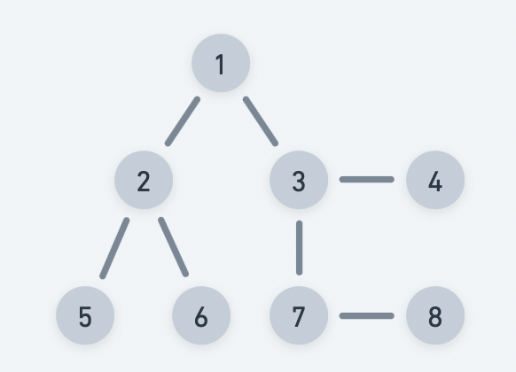
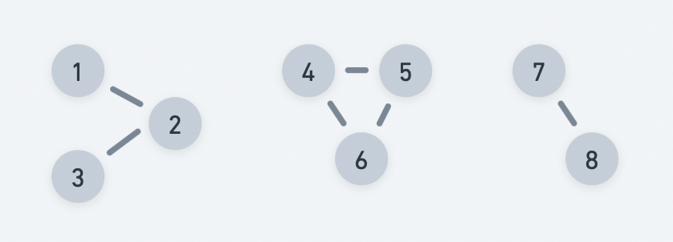

# Detect Cycle in an undirected graph - BFS

Practice [Link](https://www.geeksforgeeks.org/problems/detect-cycle-in-an-undirected-graph/1?itm_source=geeksforgeeks&itm_medium=article&itm_campaign=practice_card)

Given an undirected graph with V vertices and E edges, check whether it contains any cycle or not. 


> No Cycle



> Cycle exists

## Note
Graph can also be disconnected -> Check for every node as source/starting node.

Intiution:
- Start from one node(unvisited) and explore all nodes.
- Use visited array to keep track of explored nodes.
- Also use parent, as we are dealing with undirected graph, to avoid false positive cycle detection.
- If during traversal we find a node that is already explored/visited, it means that we came from two different paths and explored same node and thus the cycle exists. 
- Continue traversal, until all nodes are visited or we find a cycle.


```
class Solution{
public:

    bool isCycleBFS(vector<int> adj[], int src, vector<bool> &visited){
        queue<pair<int,int>> q;
        q.push({src, -1});
        visited[src] = true;

        while(!q.empty()){
            auto [currNode, parentNode] = q.front();
            q.pop();

            for(auto nextNode: adj[currNode]){
                if(!visited[nextNode]){
                    visited[nextNode] = true;
                    q.push({nextNode, currNode});
                }
                else if(nextNode != parentNode){
                    return true;
                }
            }

        }
        return false;
    }

    bool isCycle(int V, vector<int> adj[]) {
        vector<bool> visited(V, false);

        for(int i=0;i<V;i++){
            if(!visited[i] && isCycleBFS(adj, i, visited))
                return true;
        }
        return false;
    }
};
```


### Time Complexity: O(V+E) + O(N), 
We are exploring every vertex V and exploring all its edges. 
O(N) -> For covering disconnected components


### Space Complexity: O(N)+O(V+E), 
O(N) to keep visited nodes, and O(V+E) to create the adjacency list.