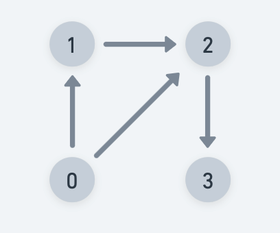

# Detect Cycle in an directed graph - DFS

Practice [Link](https://www.geeksforgeeks.org/problems/detect-cycle-in-a-directed-graph/1?itm_source=geeksforgeeks&itm_medium=article&itm_campaign=practice_card)

Given an directed graph with V vertices and E edges, check whether it contains any cycle or not. 


> No Cycle


> Cycle exists

## Note
Graph can also be disconnected -> Check for every node as source/starting node.

Cannot just use visited node as a check for cycle. Following case shows that `2` is visited and not the parent for `3`, but still cycle not there.


## Intiution
- Cycle exists only if there is a `back-edge` (node points to one of its ancestors in DFS tree)
- Keep track of visited array and also all nodes that are in current recursion stack(recStk), which is the path that we have visited.
- While backtracking remove node from `recStk` 

** If you want to print the nodes in the cycle. The recStk will have the nodes after the DFS terminates.


## Implementation

```

bool isCyclicDFS(vector<vector<int>> adj, vector<bool> &visited, vector<bool> &recStk, int u)
{
    visited[u] = true;
    recStk[u] = true;
    
    for(int v: adj[u])
    {
        if(!visited[v] && isCyclicDFS(adj, visited, recStk, v))
            return true;
        else if(recStk[v])
            return true;
    }
    
    recStk[u]=false;
    return false;
}
// Function to detect cycle in a directed graph.
bool isCyclic(int V, vector<vector<int>> adj) {
    vector<bool> visited(V, false);
    vector<bool> recStk(V, false);
    
    for(int i=0;i<V;i++)
    {
        if(!visited[i] && isCyclicDFS(adj, visited, recStk, i))
            return true;
    }
    return false;
}

```


## Complexities

### Time Complexity: O(V+E) + O(N)
We are exploring every vertex V and exploring all its edges. 
O(N) -> For covering disconnected components

Same TC as DFS


### Space Complexity: O(N)+O(V+E), 
O(N) to keep visited nodes, and O(V+E) to create the adjacency list.
