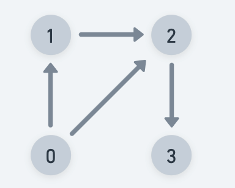
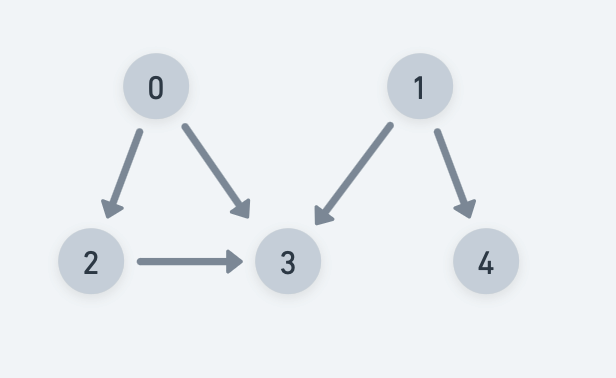
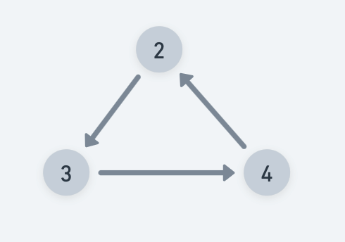

# Topological sort - DFS

Practice [Link](https://www.geeksforgeeks.org/problems/topological-sort/1)

Topological Sort is a linear ordering of nodes such that if edge `u -> v` exists, then `u` appears before `v`.

In-degree of a node: Number of incoming edges for a node



> In-degree of node 0: 0
>
> In-degree of node 1: 1
> 
> In-degree of node 2: 3
> 
> In-degree of node 3: 1

## Sample


> [0,1,4,2,3]


## Note
Graph can also be disconnected -> Check for every node as source/starting node.


This can be possible only for `DAG ( Directed acyclic graph)` because in an undirected graph we can’t decide which node will come first because there will be no direction, and if there is a cycle topological order will not be possible (See below figure to understand why it is not possible for graphs containing cycle). For reference, see below image.




## Intiution

- Use visited array and a stack(keep track of visited nodes)
- For every node v: adj[u], call DFS(v)
- add ```u``` to the stack once all adjacent nodes are visited


```
void DFS(adj, vis, stk, u)
{
    vis[u]= truel
    for(auto vL adj[u])
        if(!vis[v])
            DFS(adj, vis, stk, v)

    stk.push(u)
}
```
  


## Implementation

```
void DFS(vector<vector<int>>& adj, vector<bool> &vis, int currNode, stack<int> &stk)
    {
        vis[currNode] = true;
        
        for(auto adjNode: adj[currNode])
        {
            if(!vis[adjNode])
                DFS(adj, vis, adjNode, stk);
        }
        stk.push(currNode);
    }
  
    // Function to return list containing vertices in Topological order.
    vector<int> topologicalSort(vector<vector<int>>& adj) {
       stack<int> stk;
       vector<bool> vis(adj.size(), false);

       //covering all disconnected components as well.
       for(int i=0;i<adj.size();i++)
       {
           if(!vis[i])
                DFS(adj, vis, i, stk);

       }
       
       vector<int> topoSort;
       while(!stk.empty())
       {
           topoSort.push_back(stk.top());
           stk.pop();
       }
       return topoSort;
    }

```


## Complexities

### Time Complexity: O(V+E) + O(N)
We are exploring every vertex V and exploring all its edges. 
O(N) -> For covering disconnected components

Same TC as DFS


### Space Complexity: O(N)+O(V+E), 
O(N) to keep visited nodes, and O(V+E) to create the adjacency list.