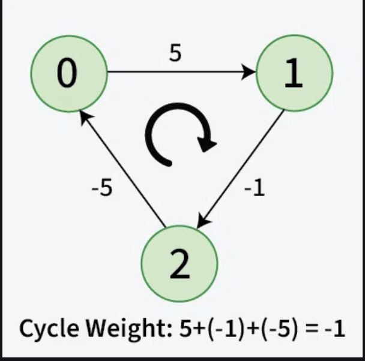

# Shortest Path Algorithm - Bellman Ford algorithm
`SINGLE SOURCE ALGORITHM`


Given a weighted and directed graph of v vertices and edges, Find the shortest distance of all the vertex's from the source vertex, src and return a list of integers where the ith integer denotes the distance of the ith node from the source node. If a vertices can't be reach from the s then mark the distance as 10^8.
Note: If there exist a path to a negative weighted cycle from the source node then return {-1}.

Practice [Link](https://www.geeksforgeeks.org/problems/distance-from-the-source-bellman-ford-algorithm/0?fbclid=IwAR2_lL0T84DnciLyzMTQuVTMBOi82nTWNLuXjUgahnrtBgkphKiYk6xcyJU)


## Negative weight cycle:

A negative weight cycle is a cycle in a graph, whose sum of edge weights is negative. If you traverse the cycle, the total weight accumulated would be less than zero.



In the presence of negative weight cycle in the graph, the shortest path doesn’t exist because with each traversal of the cycle shortest path keeps decreasing.


## Algorithm

> Bellman-Ford ALgorithm works on the principle of `relaxation of the edges`. It can detect `negative weight cycles`.

- `Relaxation` means updating the shortest distance to a node if a shorter path is found through another node. For an edge (u, v) with weight w:
- If going through u gives a shorter path to v from the source node (i.e., `distance[v] > distance[u] + w`), we update the `distance[v]` as `distance[u] + w`.
- In the bellman-ford algorithm, this process is repeated `(V – 1)` times for all the edges.

## Why (V-1) times?

- A shortest path between two vertices can have at most (V – 1) edges. It is not possible to have a simple path with more than (V – 1) edges (otherwise it would form a cycle). 
- Therefore, repeating the relaxation process (V – 1)times ensures that all possible paths between source and any other node have been covered.

## Detection of a Negative Weight Cycle

As we have discussed earlier that, we need (V – 1) relaxations of all the edges to achieve single source shortest path. 

If one additional relaxation (Vth) for any edge is possible, it indicates that some edges with overall negative weight has been traversed once more. 

This indicates the presence of a `negative weight cycle` in the graph.

## Data structures Used

- dist array: to store distance from source
- parent array: to store the path -> can backtrack and find path until `parent[u] != u`

## Implementation

```cpp
vector<int> bellmanFord(int V, vector<vector<int>>& edges, int src) {
        vector<int> dist(V, 1e8);
        dist[src] = 0;
        
        for(int i=0;i<=V-1;i++)
        {
            for(auto edge: edges)
            {
                int u = edge[0];
                int v = edge[1];
                int wt = edge[2];
                
                if(dist[u] != 1e8 && dist[v] > dist[u] + wt)
                {
                    dist[v] = dist[u]+wt;
                }
            }
        }
        for(auto edge: edges)
        {
            int u = edge[0];
            int v = edge[1];
            int wt = edge[2];
            
            if(dist[u] != 1e8 && dist[v] > dist[u] + wt)
            {
                return {-1};
            }
        }
        return dist;
    }

```


> Time Complexity: `O(V*E)`, where V = no. of vertices and E = no. of Edges.
>
>Space Complexity: `O(V)` for the distance array which stores the minimized distances.

## If Path is needed

```cpp
vector<int> bellman_ford(int V, vector<vector<int>>& edges, int S, vector<int> &parent) {
        vector<int> dist(V, 1e9);
        dist[S]=0;

        for(int i=0; i <= V-1; i++){
            for(auto edge: edges){
                int u = edge[0];
                int v = edge[1];
                int wt = edge[2];
        
                if(dist[u]!= 1e9 && dist[v] > wt + dist[u]){
                    dist[v] = wt + dist[u];
                    parent[v] = u;
                }
            }
        }

        for(auto edge: edges){
                int u = edge[0];
                int v = edge[1];
                int wt = edge[2];
        
                if(dist[u]!= 1e9 && dist[v] > wt + dist[u]){
                    return {-1};
                }
            }

        return dist;
	}

vector<int> print_bellman_ford(vector<int> parent, int S, int D){
    vector<int> path;
    if(parent[D]==-1 && S!=D)
        return path;

    for(int curr=D;curr!=-1;curr=parent[curr]){
        path.push_back(curr);
    }

    reverse(path.begin(),path.end());
    return path;
}
```