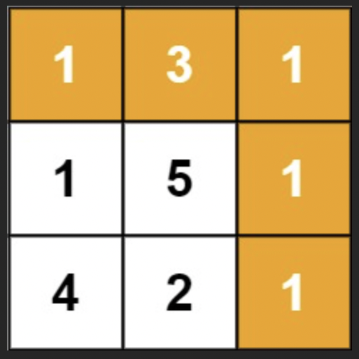

# Minimum Path Sum

Practice [Link](https://leetcode.com/problems/minimum-path-sum/description/)

Given a m x n grid filled with non-negative numbers, find a path from top left to bottom right, which minimizes the sum of all numbers along its path.

Note: You can only move either down or right at any point in time.

## Sample



> Output: 7


## Recursive Solution

```cpp
class Solution {
public:
    int minPathSumUtil(vector<vector<int>>& grid, int m, int n)
    {
        if(m==0 && n==0)
            return grid[0][0];

        if(m<0 || n<0)
            return INT_MAX;

        return grid[m][n] + min(minPathSumUtil(grid, m-1,n), minPathSumUtil(grid, m, n-1));
    }
    int minPathSum(vector<vector<int>>& grid) {
        int m = grid.size(), n= grid[0].size();
        return minPathSumUtil(grid, m-1,n-1);
    }
};
```
> Time Complexity: `O(2^n)`
> 
> Space Compelexity: `O(n) `

## Memoized Version


```cpp
class Solution {
public:
    int minPathSumUtil(vector<vector<int>>& grid, int m, int n, vector<vector<int>> &memo)
    {
        if(m==0 && n==0)
            return grid[0][0];

        if(m<0 || n<0)
            return INT_MAX;

        if(memo[m][n] != -1)
            return memo[m][n];

        return memo[m][n] = grid[m][n] + min(minPathSumUtil(grid, m-1,n, memo), minPathSumUtil(grid, m, n-1, memo));
    }
    int minPathSum(vector<vector<int>>& grid) {
        int m = grid.size(), n= grid[0].size();
        vector<vector<int>> memo(m, vector<int>(n, -1));
        return minPathSumUtil(grid, m-1,n-1, memo);
    }
};
```


> Time Complexity: `O(m*n)`
>
> Space Complexity: `O(m*n)` + `O(n) `


## Tabulation

```cpp

class Solution {
public:

    int minPathSum(vector<vector<int>>& grid) {
        int m = grid.size(), n= grid[0].size();
        vector<vector<int>> dp(m, vector<int>(n, 0));

        dp[0][0] = grid[0][0];

        for(int i=1;i<m;i++)
            dp[i][0] = grid[i][0] + dp[i-1][0];

        for(int j=1;j<n;j++)
            dp[0][j] = grid[0][j] + dp[0][j-1];

        for(int i=1;i<m;i++)
        {
            for(int j=1;j<n;j++)
            { 
                dp[i][j] = grid[i][j] + min(dp[i-1][j], dp[i][j-1]);
            }
        }

        return dp[m-1][n-1];
    }
};

```


> Time Complexity: `O(m*n)`
>
> Space Complexity: `O(m*n)`

## BFS Approach

```cpp
class Solution {
public:
    int minPathSum(vector<vector<int>>& grid) {
        int m = grid.size();
        int n = grid[0].size();
        
        vector<vector<int>> path(m, vector<int>(n, INT_MAX));
        path[0][0] = grid[0][0];
        queue<pair<int,int>> q;
        q.push({0,0});
        
        while(!q.empty())
        {
            int x = q.front().first;
            int y = q.front().second;
            q.pop();
            
            if(x==m-1 && y == n-1)
                return path[x][y];
            
            if(x+1 < m)
            {
                if(path[x+1][y] > path[x][y] + grid[x+1][y])
                {
                    q.push({x+1,y});
                    path[x+1][y] = path[x][y] + grid[x+1][y];
                }
            }
            if(y+1 < n)
            {
                if(path[x][y+1] > path[x][y] + grid[x][y+1])
                {
                    q.push({x,y+1});
                    path[x][y+1] = path[x][y] + grid[x][y+1];
                }
            }
        }
        return 0;
    }
};
```
